Deliberately hostile diagrams: complex syntax, user-authored colors that
bypass the site palette, and diagram types with their own color systems.

Author colors must be **raw literals** — Mermaid's parsers reject
`var()` expressions outright — so theming relies on the build pipeline:
palette literals map to CSS variables, everything else survives verbatim.

## Big sequence with control flow

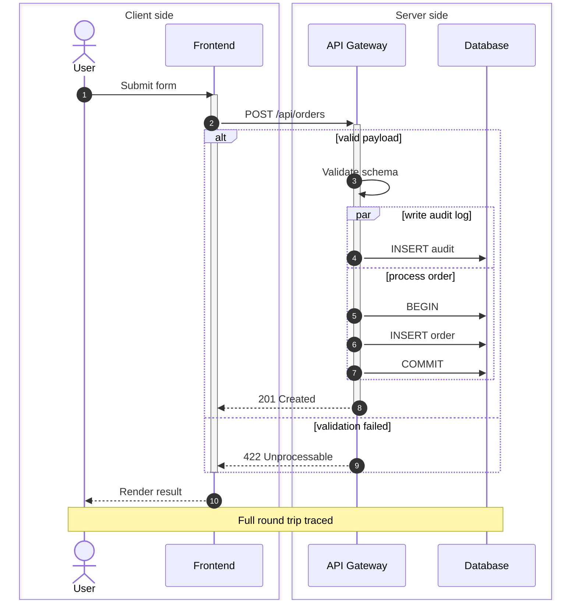
```mermaid
sequenceDiagram
    autonumber
    box transparent Client side
    actor U as User
    participant FE as Frontend
    end
    box transparent Server side
    participant API as API Gateway
    participant DB as Database
    end

    U->>FE: Submit form
    activate FE
    FE->>+API: POST /api/orders
    alt valid payload
        API->>API: Validate schema
        par write audit log
            API->>DB: INSERT audit
        and process order
            API->>DB: BEGIN
            API->>DB: INSERT order
            API->>DB: COMMIT
        end
        API-->>-FE: 201 Created
    else validation failed
        API-->>FE: 422 Unprocessable
    end
    deactivate FE
    FE-->>U: Render result
    Note over U,DB: Full round trip traced
```

## Flowchart with author-defined colors

Author colors (classDef / style) are intentional: they must survive
tokenization untouched and still pass the contrast audit. classDef/style
values pass through verbatim, so **site tokens work here too** (they do
not in sequence `box`, whose parser only accepts color literals).

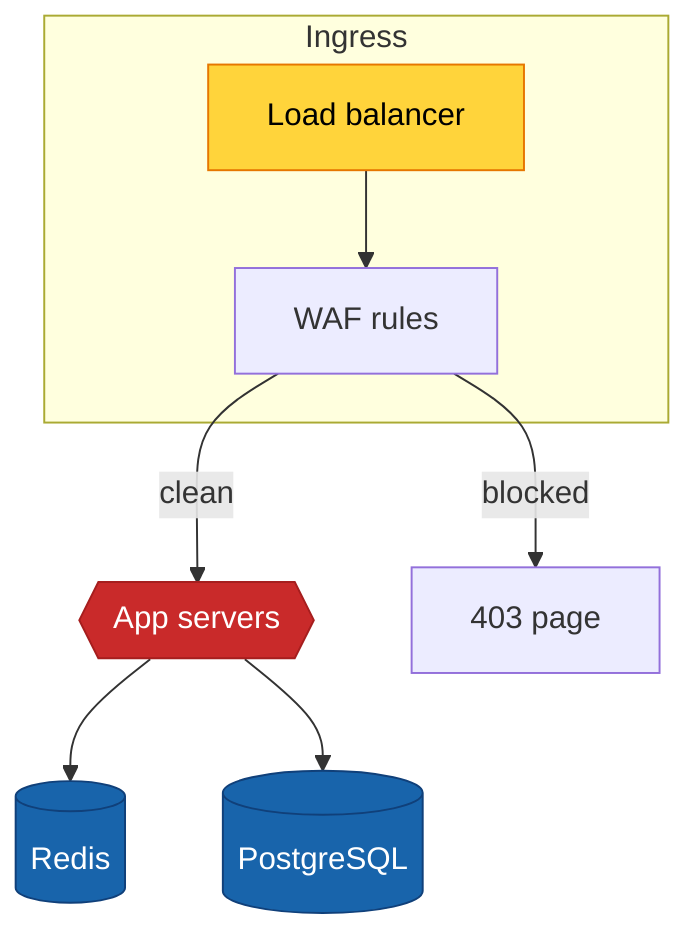
```mermaid
flowchart TD
    subgraph ingress [Ingress]
        LB[Load balancer] --> WAF[WAF rules]
    end
    WAF -->|clean| APP{{App servers}}
    WAF -->|blocked| T[403 page]
    APP --> CACHE[(Redis)]
    APP --> PG[(PostgreSQL)]

    classDef hot fill:#c92a2a,stroke:#a61e1e,color:#ffffff
    classDef cool fill:#1864ab,stroke:#10407a,color:#ffffff
    class APP hot
    class CACHE,PG cool
    style LB fill:#ffd43b,stroke:#e67700,color:#000000
```

## Git graph

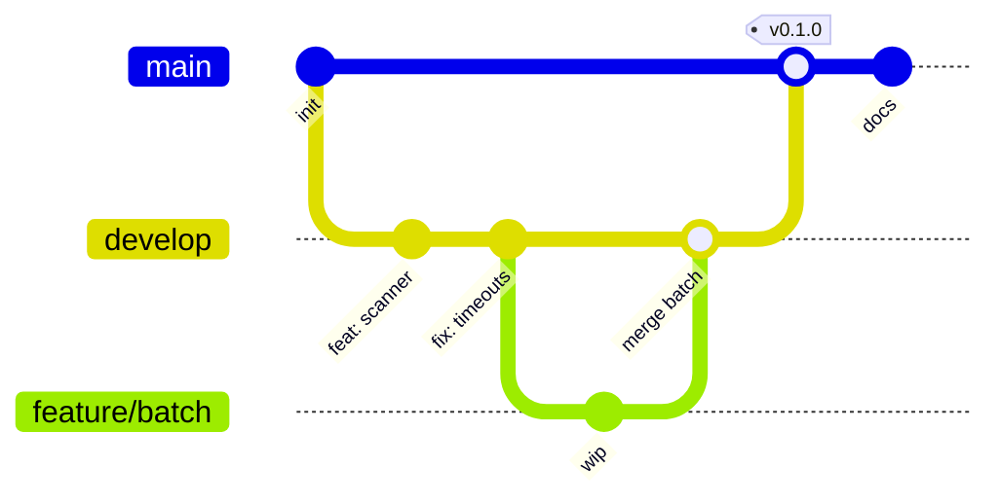
```mermaid
gitGraph
    commit id: "init"
    branch develop
    commit id: "feat: scanner"
    commit id: "fix: timeouts"
    branch feature/batch
    commit id: "wip"
    checkout develop
    merge feature/batch id: "merge batch"
    checkout main
    merge develop tag: "v0.1.0"
    commit id: "docs"
```

## Timeline

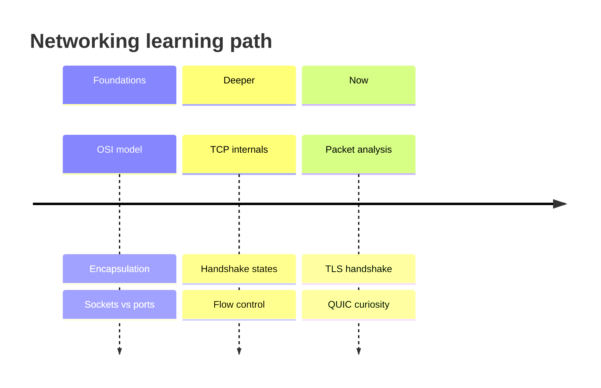
```mermaid
timeline
    title Networking learning path
    section Foundations
        OSI model : Encapsulation : Sockets vs ports
    section Deeper
        TCP internals : Handshake states : Flow control
    section Now
        Packet analysis : TLS handshake : QUIC curiosity
```

## User journey

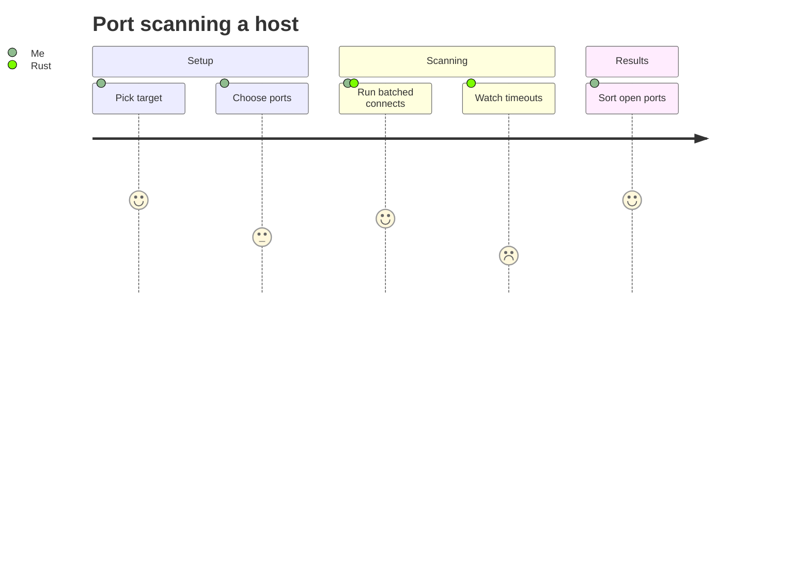
```mermaid
journey
    title Port scanning a host
    section Setup
      Pick target: 5: Me
      Choose ports: 3: Me
    section Scanning
      Run batched connects: 4: Me, Rust
      Watch timeouts: 2: Rust
    section Results
      Sort open ports: 5: Me
```

## Quadrant chart

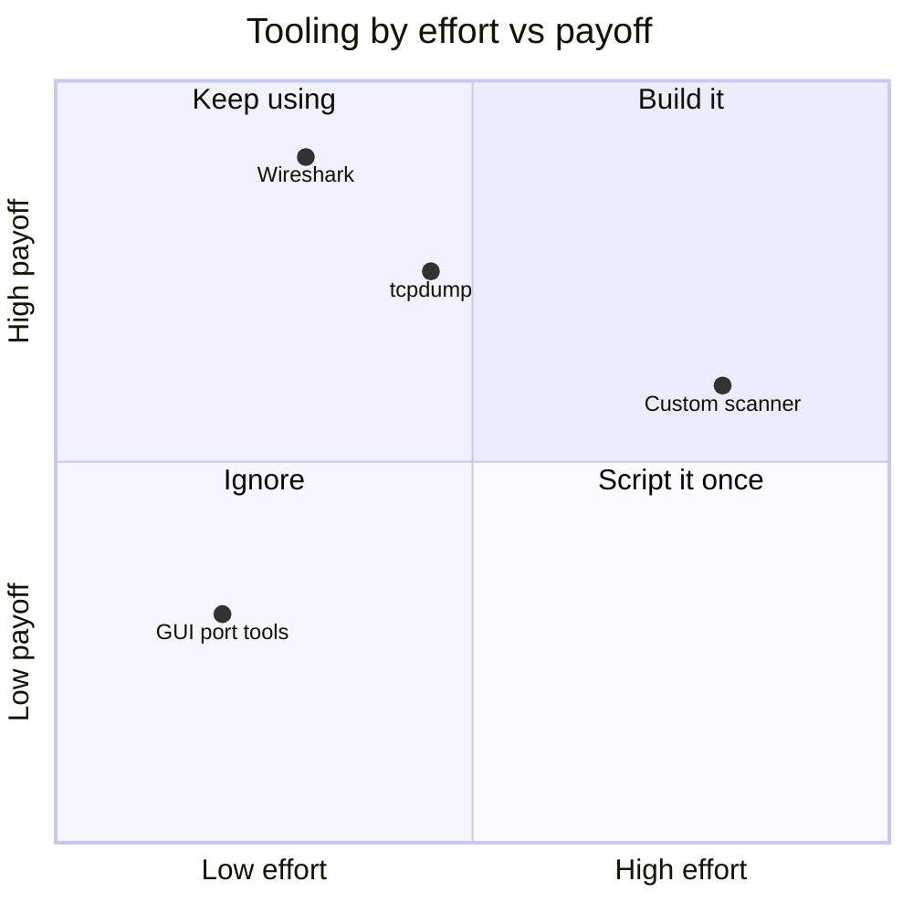
```mermaid
quadrantChart
    title Tooling by effort vs payoff
    x-axis Low effort --> High effort
    y-axis Low payoff --> High payoff
    quadrant-1 Build it
    quadrant-2 Keep using
    quadrant-3 Ignore
    quadrant-4 Script it once
    Wireshark: [0.3, 0.9]
    tcpdump: [0.45, 0.75]
    Custom scanner: [0.8, 0.6]
    GUI port tools: [0.2, 0.3]
```

## XY chart

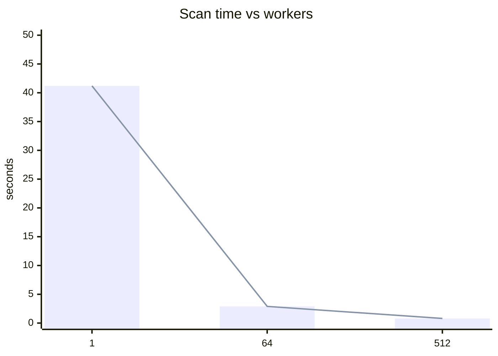
```mermaid
xychart-beta
    title "Scan time vs workers"
    x-axis [1, 64, 512]
    y-axis "seconds" 0 --> 50
    bar [41.2, 2.9, 0.8]
    line [41.2, 2.9, 0.8]
```

## Mindmap

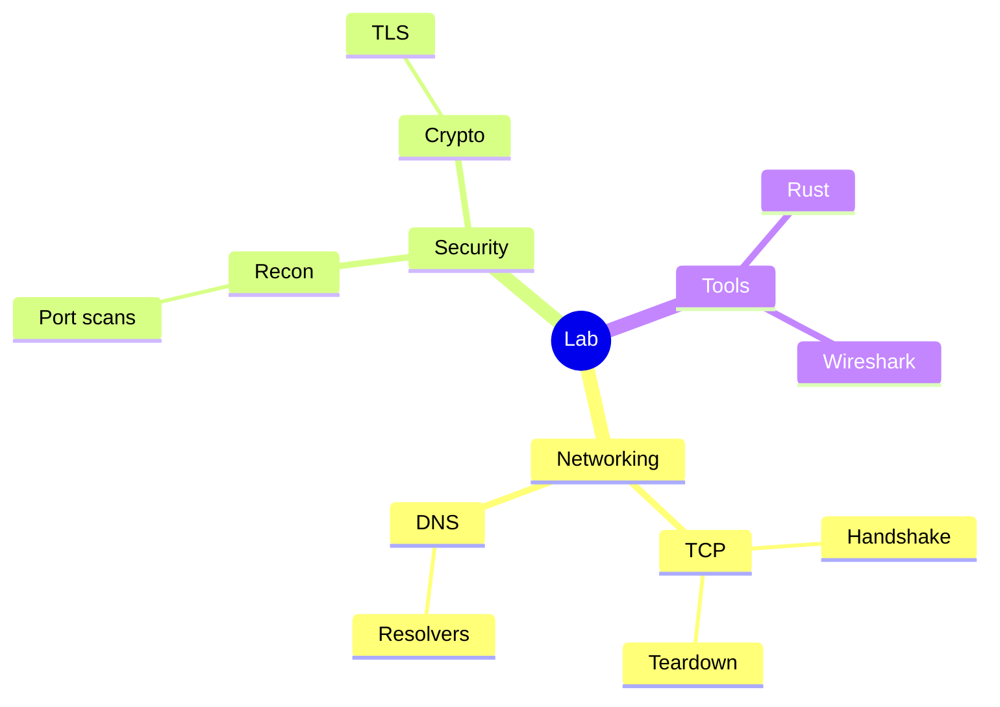
```mermaid
mindmap
  root((Lab))
    Networking
      TCP
        Handshake
        Teardown
      DNS
        Resolvers
    Security
      Recon
        Port scans
      Crypto
        TLS
    Tools
      Rust
      Wireshark
```

## Class diagram, hostile

Generics, namespaces, annotations, static members, notes — class diagrams
ship their own purple-ish default palette.

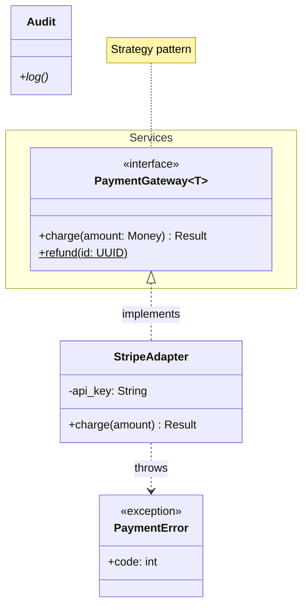
```mermaid
classDiagram
    namespace Services {
      class PaymentGateway~T~ {
        <<interface>>
        +charge(amount: Money) Result
        +refund(id: UUID)$
      }
    }
    class StripeAdapter {
      -api_key: String
      +charge(amount) Result
    }
    class PaymentError {
      <<exception>>
      +code: int
    }
    PaymentGateway <|.. StripeAdapter : implements
    StripeAdapter ..> PaymentError : throws
    note for PaymentGateway "Strategy pattern"
    class Audit {
      +log()*
    }
```

## ER diagram

Every cardinality form plus attribute keys (PK/FK/UK) and quoted comments.

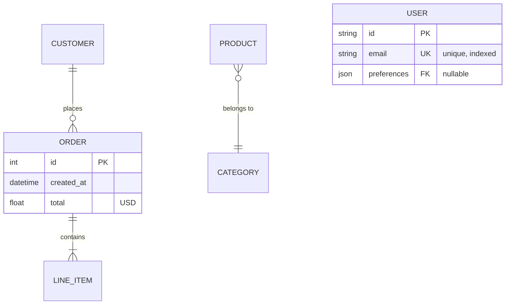
```mermaid
erDiagram
    CUSTOMER ||--o{ ORDER : places
    ORDER ||--|{ LINE_ITEM : contains
    PRODUCT }o--|| CATEGORY : "belongs to"
    USER {
      string id PK
      string email UK "unique, indexed"
      json preferences FK "nullable"
    }
    ORDER {
      int id PK
      datetime created_at
      float total "USD"
    }
```

## State machine with composites and concurrency

Nested states, fork/join, choice pseudo-states, notes.

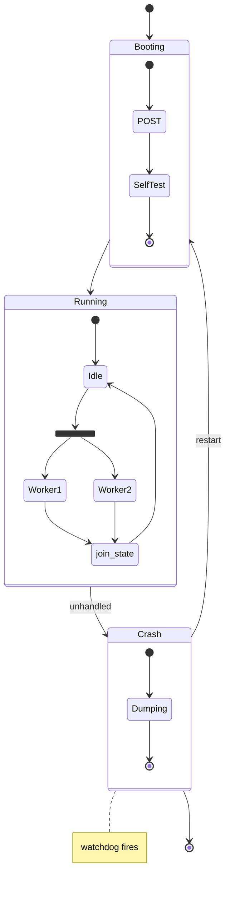
```mermaid
stateDiagram-v2
    direction TB
    [*] --> Booting
    state Booting {
      [*] --> POST
      POST --> SelfTest
      SelfTest --> [*]
    }
    Booting --> Running
    state Running {
      [*] --> Idle
      state fork_state <<fork>>
      Idle --> fork_state
      fork_state --> Worker1
      fork_state --> Worker2
      Worker1 --> join_state
      Worker2 --> join_state
      state join_state <<join>>
      join_state --> Idle
    }
    Running --> Crash : unhandled
    state Crash {
      [*] --> Dumping
      Dumping --> [*]
    }
    Crash --> Booting : restart
    note right of Crash : watchdog fires
    Crash --> [*]
```

## Pie chart

Own color system (`pie0`–`pie11`) with no theme-variable hook for slices.

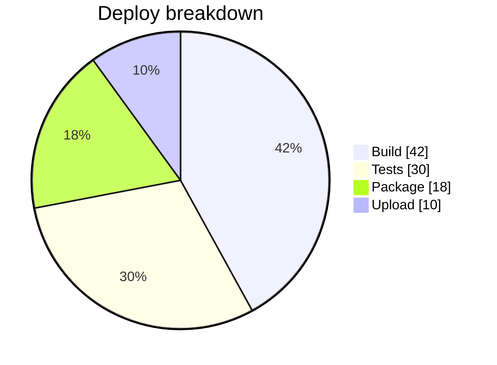
```mermaid
pie showData title Deploy breakdown
    "Build" : 42
    "Tests" : 30
    "Package" : 18
    "Upload" : 10
```

## Gantt with excludes and milestones

Weekend exclusion, critical tasks, milestone markers.

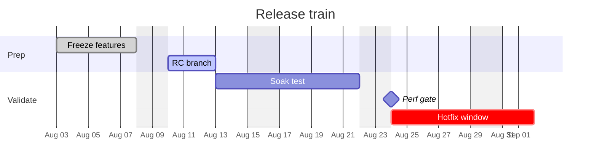
```mermaid
gantt
    title Release train
    dateFormat YYYY-MM-DD
    axisFormat %b %d
    excludes weekends
    section Prep
      Freeze features :done, f1, 2026-08-03, 5d
      RC branch :active, rc1, after f1, 3d
    section Validate
      Soak test : s1, after rc1, 7d
      Perf gate : milestone, m1, after s1, 0d
      Hotfix window : crit, h1, after m1, 7d
```

## Kanban

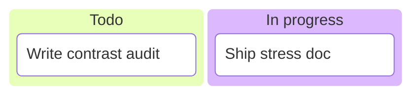
```mermaid
kanban
  todo[Todo]
    t1[Write contrast audit]
  doing[In progress]
    d1[Ship stress doc]
```

## Sankey

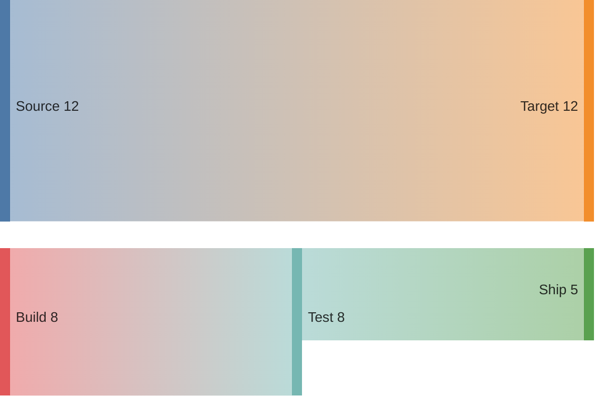
```mermaid
sankey-beta
    Source,Target,12
    Build,Test,8
    Test,Ship,5
```

## Icon packs

`@iconify-json/logos` is registered at build time (trimmed to the icons
used here); node and service shapes pull real brand glyphs.

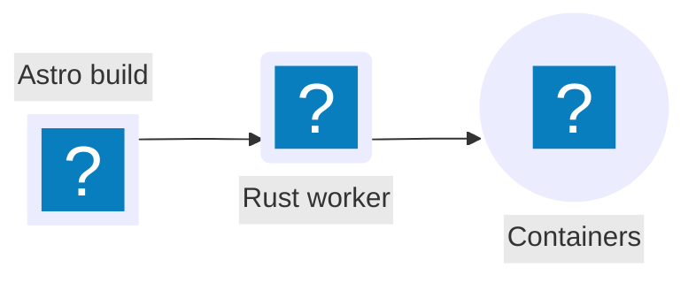
```mermaid
flowchart LR
    a@{ icon: "logos:astro", form: "square", label: "Astro build", pos: "t" }
    r@{ icon: "logos:rust", form: "rounded", label: "Rust worker" }
    d@{ icon: "logos:docker", form: "circle", label: "Containers", pos: "b" }
    a --> r --> d
```

## Architecture

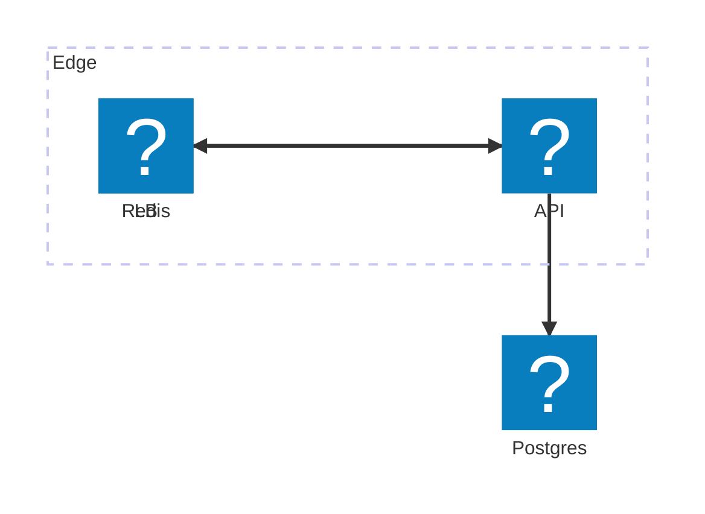
```mermaid
architecture-beta
    group edge[Edge]
    service lb(logos:nginx)[LB] in edge
    service api(logos:astro)[API] in edge
    service db(logos:postgresql)[Postgres]
    service cache(logos:redis)[Redis]

    lb:R --> L:api
    api:B --> T:db
    api:L --> R:cache
```

## Block diagram

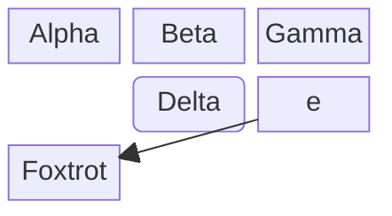
```mermaid
block-beta
    columns 3
    a["Alpha"] b["Beta"] c["Gamma"]
    space d("Delta")
    e --> f["Foxtrot"]
```

## Flowchart torture II

Nested subgraphs with direction overrides, invisible links, every node
shape, per-link styling, markdown-string labels, unicode and emoji,
one absurdly long label.

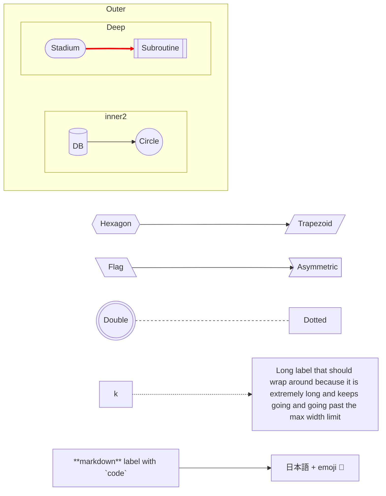
```mermaid
flowchart LR
    subgraph outer [Outer]
      direction TB
      subgraph inner1 [Deep]
        a([Stadium]) --> b[[Subroutine]]
      end
      subgraph inner2
        c[(DB)] --> d((Circle))
      end
      inner1 ~~~ inner2
    end
    e{{Hexagon}} --> f[/Trapezoid/]
    g[\Flag\] --> h>Asymmetric]
    i(((Double))) --- j[Dotted]
    k -.-> l[Long label that should wrap around because it is extremely long and keeps going and going past the max width limit]
    m["**markdown** label with `code`"] --> n["日本語 + emoji 🚀"]
    linkStyle 0 stroke:#ff0000,stroke-width:3px
    linkStyle 5 stroke-dasharray:4
```

## Sequence torture II

Custom autonumber start/step, `rect` highlight bands, create/destroy,
bidirectional and async arrows, critical/option and break blocks.

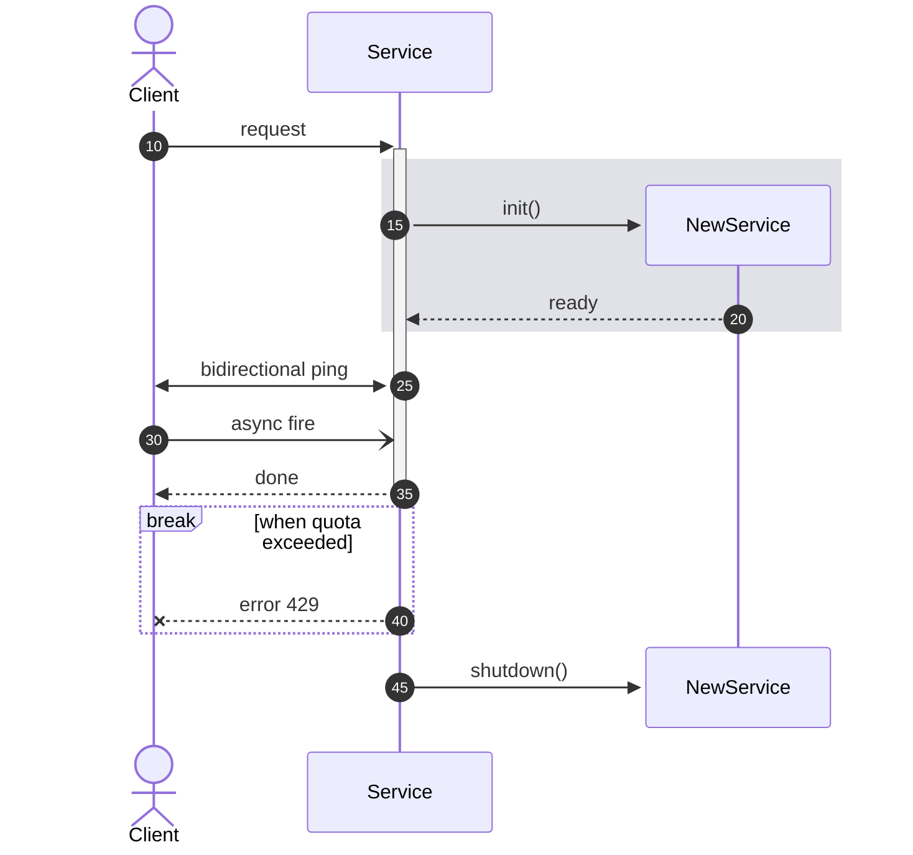
```mermaid
sequenceDiagram
    autonumber 10 5
    actor A as Client
    participant S as Service
    A->>+S: request
    rect rgb(88, 96, 120, 0.18)
      create participant D as NewService
      S->>D: init()
      D-->>S: ready
    end
    S<<->>A: bidirectional ping
    A-)S: async fire
    S-->>-A: done
    break when quota exceeded
      S--xA: error 429
    end
    destroy D
    S->>D: shutdown()
```

## C4 context

C4 ships its own blue-heavy palette (`personBackground`,
`external_personBackground`, …) that must fold into the token map.

```mermaid
C4Context
    title System context — diagram lab
    Person(reader, "Reader", "Views lab pages")
    System(site, "Lab site", "Diagrams rendered at build time")
    System_Ext(cdn, "Icon CDN", "Iconify glyph data")
    Rel(reader, site, "Reads", "HTTPS")
    Rel(site, cdn, "Fetches icons", "build time")
```

## Code blocks

Fenced code exercises the shiki path: dual themes, chrome, fence meta.

```rust title="src/scanner.rs" ln {4,7-9}
use std::net::TcpStream;
use std::time::Duration;

/// A single TCP connect probe with a hard timeout.
fn probe(target: &str, port: u16) -> std::io::Result<()> {
    let addr = format!("{target}:{port}");
    let timeout = Duration::from_millis(800);
    let stream = TcpStream::connect_timeout(
        &addr.parse().expect("valid socket addr"),
        timeout,
    )?;
    drop(stream);
    Ok(())
}
```

Plain text falls back to unhighlighted but fully chromed output:

```txt
rate_limit = token_bucket(capacity=10, refill_per_s=2)
allow = rate_limit.acquire(key="192.0.2.7")
```

HTML fences highlight tags and attributes:

```html
<figure class="diagram">
  <svg viewBox="0 0 100 40" role="img" aria-label="tiny diagram"></svg>
</figure>
```

Long lines must scroll horizontally — this one is deliberately far past any
reasonable column so the overflow policy can be verified on a phone:

```bash
nmap -sS -p- --min-rate 4000 --max-retries 2 -T4 -oA scan-full-tcp --script banner,vulners 203.0.113.0/24
```

Opt-in wrapping for prose-like blocks:

```text wrap
This block opts into soft wrapping. It contains a very long line that would otherwise force horizontal scrolling: the quick brown fox jumps over the lazy dog repeatedly until the line finally reaches a width no sane viewport would display without scrolling.
```
