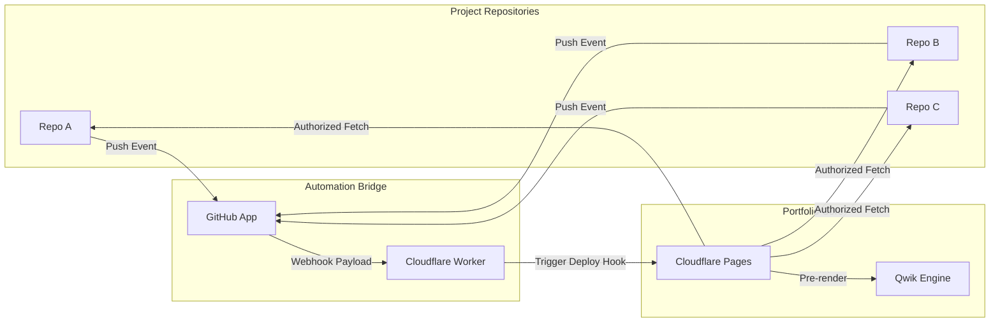

## The Problem
Technical portfolios often suffer from "Documentation Rot"—where the project code evolves on GitHub, but the portfolio remains stale because manual updates are high-friction. Standard CMS solutions add unnecessary overhead and don't fit into a developer's Git-centric workflow.

The goal was to engineer a "Zero-Maintenance" system where the portfolio acts as a **distributed consumer** of the documentation already living in my project repositories.

## Architecture & Implementation

### 1. Distributed Source-of-Truth
Instead of a central database, this engine treats every GitHub repository as a data node. By leveraging the GitHub Search API and a standardized `portfolio.md` schema, the engine aggregates content from across my account. This ensures that the documentation lives exactly where the code does.

### 2. Rate-Limit Resilient Pipeline (SSG)
Fetching data from the GitHub API at runtime is fragile due to strict rate limits (60 req/hr for unauthenticated calls). I solved this by implementing a **Static Site Generation (SSG)** pipeline. 
- **Build-Time Fetching**: Content is crawled and validated at compile-time using a secure `GITHUB_TOKEN`.
- **Pre-rendering**: All dynamic routes are converted to static HTML files during the CI/CD process on Cloudflare Pages.
- **Result**: Sub-100ms load times and a site that never breaks, even if the GitHub API is down.

### 3. Schema-Driven Data Validation
To ensure the integrity of the distributed data, I implemented a strict validation layer using **Zod**. Every project and writeup must pass a schema check for metadata (tags, year, category) and content structure before it is accepted into the build. This prevents malformed data from breaking the production site.

## System Architecture

## Automation Infrastructure
The "Zero-Maintenance" promise is realized through a custom-engineered deployment bridge. This isn't just a simple webhook; it is a professional integration involving:

*   **Custom GitHub App**: Installed account-wide to eliminate per-repository configuration.
*   **Secure Webhook Proxy**: A Cloudflare Worker that validates incoming payloads and acts as an intelligent traffic controller.
*   **Infrastructure-as-Code Flow**: Decoupling content updates from code deployments, allowing the site to grow without manual intervention.

When a push occurs in any repository tagged with `portfolio`, the loop is triggered: **Push Code → App Broadcast → Worker Proxy → Build Pipeline → Site Update.**

## Impact
This project demonstrates a transition from "Web Design" to "Systems Engineering." It solves real-world constraints of API rate-limiting, data validation, and automated deployment lifecycles, resulting in a portfolio that is both a showcase of my work and a piece of engineered infrastructure in itself.
